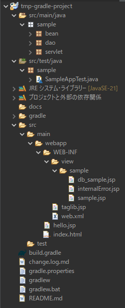

# 非Spring対応Webアプリケーション用Gradleプロジェクトテンプレート

このテンプレートは、非SpringのWebアプリケーションを開発するGradleプロジェクトのテンプレートです。

GradleプロジェクトはSpringと相性がいいですが、ここでは従来のJP+ServletによるWebアプリケーション開発用のGradleプロジェクトのテンプレートを作りました。

## 目次

	- インストール方法
	- 使用方法
	- ディレクトリ構成


## インストール方法

大きく以下の３つのステップに分けて説明します。

	1. レポジトリのフォークとクローン
		- GitHubからのフォークとクローンの手順を説明します。
	2. Eclipseへのインポート
		- Eclipseへのインポートと必要な設定を行う手順を説明します。
	3. ビルドとTomcatの起動
		- GradleでのビルドとTomcatの起動の手順について説明します。

### Step-1. レポジトリのフォークとクローン

	1-1. GitHubからこのレポジトリをフォークします。
		- GitHubのこのレポジトリにアクセスし、画面右上にある［Fork］ボタンをクリックします。
		- フォークが完了すると、自分のレポジトリに新しくコピーされていることを確認してください。
	
	1-2. フォークしたレポジトリをローカルにクローンします。
		 以下のコマンドでクローンしますが、「$user_name$」の部分は自分のGitHubアカウント名に置き換えてください。
````bash
	git clone http://github.com/$user_name$/tmp-gradle-project.git
````


### Step-2. Eclipseへのインポート

	2-1. クローンしたレポジトリをEclipseでインポートします。
		
			- プロジェクトの種類：「既存のGradleプロジェクト」
			- プロジェクトルートディレクトリ：クローンしたレポジトリのフルパス
			- ワークスペース設定を上書き：オン
			- Gradleラッパー：オン

		「ワークスペース設定を上書き」をオンにすると、画面下部に並んでいる以下のチェックボックスがオンになります：

			- 自動的にプロジェクトを同期
			- コンソールビューの表示
			- 実行ビューの表示

	2-2. インポートが完了すると、Eclipseの左側のパッケージエクスプローラーにプロジェクトが表示されます。
		 インポート直後は「tmp-gradle-project」という名前が表示されます。
	
	2-3. 以下のマウス操作でプロジェクトを更新します。
		 パッケージエクスプローラーでプロジェクト名を右クリック→build.gradleを右クリック→「Gradleプロジェクトのリフレッシュ」を選択します。


### Step-3. ビルドとTomcatの起動

	3-1. ビルドを実行するために、Eclipseのターミナルタブにローカルターミナルを追加します。
		 プロジェクト名を右クリックして、［ローカルターミナルに表示］→［ターミナル］を選択します。
		 すると、画面下部のターミナルタブにプロジェクトディレクトリがカレントディレクトリとして表示されます。

	3-2. ターミナルで以下のコマンドを実行してビルドを行います。

		 ビルドが成功すると、「build success」という緑色の文字が表示されます。
````bash
	gradle build
````
	
	3-3. Tomcatを起動します。
		 このプロジェクトでは、Eclipseにバンドルされた「Tomcat10_Java21」を使用します。

		 3-3.1. サーバータブで「Tomcat10_Java21」を右クリックし、「追加及び除去...」を選択します。
		 3-3.2. 左側の「使用可能」ボックスに表示されたプロジェクト名をクリックし、中央の［追加］ボタンをクリックします。
		 3-3.3. 右側の「構成済み」ボックスにプロジェクト名が表示されるので、［完了］ボタンをクリックします。
		 3-3.4. サーバータブの「Tomcat10_Java21」を右クリックして「起動」を選択すると、サーバーが起動します。
	
	3-4. ブラウザを起動して「http://localhost:8080/tmp-gradle-project」にアクセスします。
		 「Gradleプロジェクトテンプレート」という見出しの画面が表示されれば、設定は成功です。

### Step-4. プロジェクト名の変更

Step-3までを実施することで配布もとと同様の動作が確認できたことになります。

しかし、このままではプロジェクト名が「tmp-gradle-project」というテンプレートプロジェクト名のままなので、ここのプロジェクトに応じてプロジェクト名を変更しておきます。

変更の仕方は以下のとおりです：

	4-1. パッケージエクスプローラでプロジェクト名を右クリックして［リファクタリング］→［名前変更］を選択します。
	4-2. 名前変更のウィンドウで

			新しい名前：$new_project_name$

		 と入力して［OK］ボタンをクリックします。
		 このとき「$new_project_name$」の部分を新しいプロジェクト名に置き換えてください。

時間が少々かかりますが、名前の変更ができたら、確認のために以下のステップを実施してください：

	- プロジェクトのリフレッシュ
	- プロジェクトのビルド（「gradle clean build --no-build-cache」の実行を推奨）
	- Tomcatの再起動
	- ブラウザで「http://localhost:8080/$new_project_name$」でアクセス

以上で、プロジェクト変更前と同じようにページが表示されれば成功です。

## デレクトリ構成

このプロジェクトのディレクトリ構成は以下の図の通り：



これらのディレクトリやパッケージのなかで、開発という観点で重要なディレクトリとパッケージについて説明します。

### sampleパッケージ（sample.*）
このパッケージにはサンプルアプリケーションに関わるクラスが格納されています。
sampleパッケージ直下のサブパッケージは

	- servletパッケージ
	- daoパッケージ
	- beanパッケージ

を配置しており、このサブパッケージ構成をソースパッケージで構成し直すことで、個々の開発プロジェクトに対応します。

### src/main/webapp/ディレクトリ

src/main/webapp/ディレクトリは公開ディレクトリとして用意され、ここにHTMLといった静的なページを格納します。

サンプルアプリケーションでは、このディレクトリに配置したindex.htmlをアプリケーションのエントリポイントとして、JSPにアクセスします。

JSPはセキュリティを考慮した慣習にしたがってwebapp/WEB-INF/view以下に格納しています。サンプルアプリケーションに関わるJSPはwebapp/WEB-INF/view/sampleディレクトリに格納しています。

